# waifu4x

## 这个项目是做什么的

​		计算机计算速度的不断提升，不仅体现在我们的CPU有了更高的性能，还体现在我们的内存容量更大访问更快，显示器的分辨率也不断提高。因此，我们对于图像分辨率的要求也更加苛刻。

​		而我们的项目的功能，就是将一张（或多张）分辨率较低的图像，通过一定的技术手段，生成一张分辨率高的图像。这就是图像超分辨率重建技术。我们有时候保存了有趣的图片/表情包，想要用的时候发现竟然保存的是低像素的版本，这时候我们的项目就能解决这个问题。

## 模糊的拟合-插值算法

我们用一个简单的例子来解释插值算法在图像超分辨率重建技术的应用，对于一张分辨率 3 x 2的图像，我们要把它变成 6 x 4的图像。

原图每个像素点的亮度值是：

我们建立一个6 x 4的图像，把这6个已经知道的点，放在他们大概应该在新图的位置：

我们如何知道蓝色部分的亮度值？我们自然的联想到多项式的插值算法，多项式的插值算法帮助我们能够从若干个离散的点还原出原多项式的形式, 然而多项式与图像的区别的在于我们是没有办法用一个特定形式的表达式去表示一个图像的。所以我们只能去尝试不同的表达，寻找合适的插值形式以求达到更好的效果。

​		基于插值的方法将每一张图像都看做是图像平面上的一个点，那么对超分辨率图像的估计可以看做是利用已知的像素信息为平面上未知的像素信息进行拟合的过程，这通常由一个预定义的变换函数或者插值核来完成。基于插值的方法计算简单、易于理解，但是也存在着一些明显的缺陷。

​		首先，它假设像素灰度值的变化是一个连续的、平滑的过程，但实际上这种假设并不完全成立。其次，在重建过程中，仅根据一个事先定义的转换函数来计算超分辨率图像，不考虑图像的降质退化模型，往往会导致复原出的图像出现模糊、锯齿等现象。常见的基于插值的方法包括最近邻插值法、双线性插值法和双立方插值法等。

## 寻找图像特征-卷积

卷积数学中一种重要的运算。卷积也经常用在图像处理中。因为图像为一个两维结构，所以需要将
通常的一维卷积进行扩展。

给定一个图像$X \in \mathbb{R}^{M \times N}$, 和一个矩阵$W \in \mathbb{R}^{m\times n}$。卷积的定义为
$$
y_{ij}=\sum_{u=1}^m\sum_{v=1}^nw_{uv}\cdot x_{i-u+1,j-v+1}
$$
其中$W$被称为滤波器，也被称为卷积核。

这是卷积的一个实例：

常用的均值滤波（mean filter）就是当前位置的像素值设为滤波器窗口中所有像素的平均值，也就是$f_{uv} =\frac 1 {mn}$。
在图像处理中，卷积经常作为特征提取的有效方法。一幅图像在经过卷积操作后得到结果称为特征映射（Feature Map）。

下图给出在图像处理中几种常用的滤波器，以及其对应的特征映射。图中最上面的滤波器是常用的高斯滤
波器，可以用来对图像进行平滑去噪；中间和最下面的过滤器可以用来提取边缘特征。

## 智能化的方法-神经网络

神经网络是一组大致模仿人类大脑构造设计的算法，用于识别模式。神经网络通过机器感知系统解释传感器数据，对原始输入进行标记或聚类。神经网络所能识别的模式是包含在向量中的数值形式，因此图像、声音、文本、时间序列等一切现实世界的数据必须转换为数值。

神经网络帮助我们进行聚类和分类。可以将其理解为建立在你所存储和管理的数据之上的一个聚类与分类层。对于未标记的数据，神经网络可以按照输入样例的相似之处将数据分组；若能用已标记的数据集训练，神经网络就可以对数据进行系统分类。（更准确地说，神经网络提取特征，再输入其他算法进行聚类和分类；因此可以将深度神经网络视为更大的机器学习应用系统的一部分，这个系统中还包括强化学习、分类和回归的算法。)

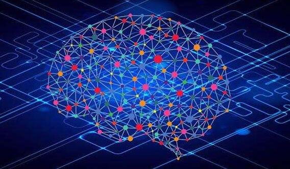

思考深度学习能够解决怎样的问题时，不妨先自问：我关注的是哪些类别？哪些信息可以作为我的行动依据？这两个问题的回答就是可以赋予数据的标签：`垃圾邮件`或`非垃圾邮件`、`好人`或`坏人`、`愤怒的客户`或`高兴的客户`。然后再问：有没有能和这些标签匹配的数据？能否找到已标记的数据，或者创建一个带标签的数据集，用来让算法学习标签与输入之间的关联？

举例而言，如果你要识别癌症高危人群，所需的训练数据集可以是一份癌症病人和健康人的名单，包括与个人身份号码相关联的所有数据，既有年龄、是否吸烟等明显特征，也包括记录动作的时间序列或网络行为记录等原始数据，这些数据或许能揭示出大量有关生活方式、习惯、兴趣和风险的信息。

你可以用这一数据集训练一个神经网络，将这些人分为癌症病人和健康人两个类别，再将分类模型应用于癌症风险未知的人，以此预测新病人的癌症风险，对有风险的患者加强关注和预防治疗。

神经网络由多个层堆叠组成, 每一层则由节点构成。运算在节点中进行，节点的运作模式与人类的神经元大致相似，遇到足够的刺激信息时就会激活并释放信号。节点将输入数据与一组系数（或称权重）结合，通过放大或抑制输入来指定其在算法学习任务中的重要性。输入数据与权重的乘积之和将进入节点的激活函数，判定信号是否继续在网络中传递，以及传递的距离，从而决定信号如何影响网络的最终结果，例如分类动作。

以下是单个节点的示意图。

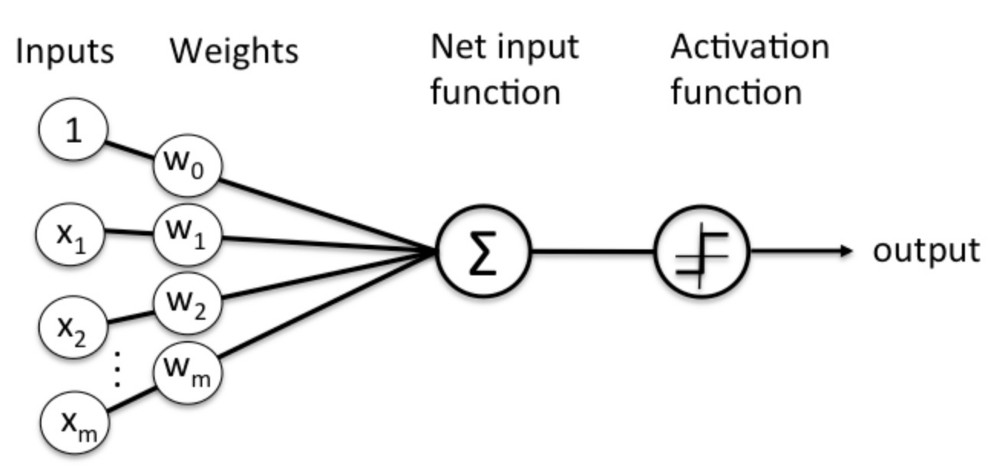

节点层是一行类似神经元的开关，在输入数据通过网络时开启或关闭。从最初接收数据的第一个输入层开始，每一层的输出同时也是下一层的输入。

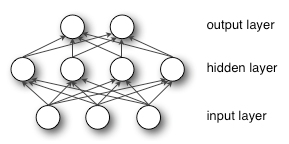

我们将输入特征与可调整的权重匹配，由此指定这些特征的重要性，即它们对网络的输入分类和聚类方式有多大程度的影响。

## 卷积神经网络

让计算机来处理图像，我自然希望计算机能识别出图像的特征。卷积网络（CNN）是一类尤其适合计算机视觉应用的神经网络，因为它们能使用局部操作对表征进行分层抽象。有两大关键的设计思想推动了卷积架构在计算机视觉领域的成功。

第一，CNN 利用了图像的 2D 结构，并且相邻区域内的像素通常是高度相关的。因此，CNN 就无需使用所有像素单元之间的一对一连接（大多数神经网络都会这么做），而可以使用分组的局部连接。

第二，CNN 架构依赖于特征共享，因此每个通道（即输出特征图）是在所有位置使用同一个过滤器进行卷积而生成的。

基于深度学习的图像超分辨率技术的重建流程主要包括以下几个步骤：

(1) 特征提取：首先对输入的低分辨率图像进行去噪、上采样等预处理，然后将处理后的图像送入神经网络，拟合图像中的非线性特征，提取代表图像细节的高频信息。

(2) 设计网络结构及损失函数：组合卷积神经网络及多个残差块，搭建网络模型，并根据先验知识设计损失函数；

(3) 训练模型：确定优化器及学习参数，使用反向传播算法更新网络参数，通过最小化损失函数提升模型的学习能力；’

(4) 验证模型：根据训练后的模型在验证集上的表现，对现有网络模型做出评估，并据此对模型做出相应的调整。

例如将卷积神经网络应用于超分辨率的开山之作, SRCNN首先使用双三次(bicubic)插值将低分辨率图像放大成目标尺寸，接着通过三层卷积网络拟合非线性映射，最后输出高分辨率图像结果。作者将三层卷积的结构解释成三个步骤：**图像块的提取和特征表示，特征非线性映射和最终的重建**。

超分辨是将输入从low-resolution（LR）重建成high-resolution（HR）输出，SRCNN中分辨率的提升主要发生在第一层:通过双三次插值先把图像提升到目标大小。

而亚像素卷积层卷积层是另一种可以提升分辨率的层，它在效率和效果上都有很好的效果。

## 必须是MSE吗？

传统的机器学习会使用pixel-wise MSE(Mean Square Error)作为量化目标图像（target）与生成图像之间差异的loss函数，通过最小化该loss函数对生成网络中的参数进行优化，进而使得生成网络中的生成图像与目标图像尽可能地接近。

 

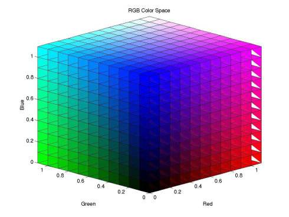

 

在传统的pixel-wise MSE中，MSE loss是根据目标图像像素点与生成图像对应像素点在**RGB空间中的欧式距离**（the euclidean distance）定义的，即

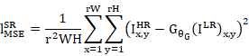

通常依据由此定义得到的loss函数进行训练会使结果拥有比较高的PSNR（峰值信噪比），但这样的定义通常会有如下的问题：
 1**它忽略了人眼的主观感受**，人眼对待图像差异的敏感程度依赖于图像的内容。换而言之，人眼对待图像中某些部分的差异会更加敏感，而对另一些部分的差异则不够敏感。例如：

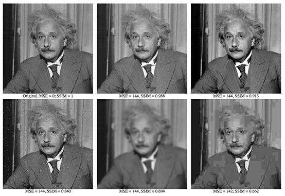

对于上述各图，若以传统的PSNR衡量，上述各图大体相等。但是人眼能够很轻易地判断上述各图的优劣。

2.在pixel-wise MSE中，计算的对象是**逐像素点**的，这潜在地忽略了图像相邻像素的结构性，造成了结构信息的失真。

 

## 题外话：拒绝RGB空间？

利用传统RGB空间的MSE loss无法表征图像的一些潜在信息，而RGB并不是唯一的色彩模型，人们常用的还有**Lab、HSV等色彩模型**。这引起我们的思考，如果将他们作为RGB的替代品、能否解决上述的问题呢？

 

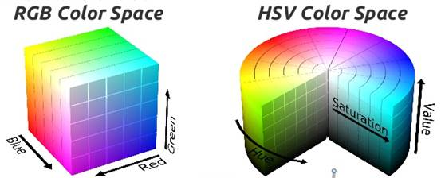

很遗憾，人们常用的色彩模型仍然跳脱不出“**模型是逐像素点的**”这一局限性，尽管对于部分结果有或多或少的改进，但由于不同色彩空间通常只是简单的线性变换，其仍旧不能提取图像深层信息，并未触及问题本质。

 

## 更复杂的空间——借助神经网络？

不同的色彩模型本质上只是一些比较简单的映射。而如果要提取图像的结构等深层信息，需要对整个图像进行更为复杂的映射。

如何才能产生更复杂的映射，一个自然的想法是**运用神经网络**（此时不仅有生成图像的生成网络，还有计算生成图像优劣的loss函数的损失网络）

 

## Perceptual Loss by VGG-19

首先我们思考的是能否借助某些现有的神经网络提取图像的深层信息（一定程度上可以减少训练成本）。

这看上去是一个比较荒谬的想法，因为我们需要的是一个能够提取图像深层信息的网络，然而**所有的神经网络都是我们训练出来**的（就如我们的生成网络一样！），**并没有人专门训练了一个目的为提取图像深层信息的网络。**

 

*当两种学习存在共同的联结时，第一种学习上的进步能够迁移到另一种学习上*

*——（美）桑代克*

 

但我们不妨换个思路，也许我们找不到专门用于提取图像深层信息的神经网络，但**提取图像深层信息这一需要并不只是超分辨率所独有的**，在CV的诸多方向（风格转化、超分辨率、图像识别、图像上色…）中都依赖于此。比如图像识别，用于图像识别的神经网络的前几个卷积层实际上承担的功能即是挖掘图像深层信息，然后再借助于全连接层、softmax层等实现最后的图像分类。

于是，我们很自然地想到，**只要将一个经过预训练的优秀图像识别网络的前面卷积层部分单独提取出来，我们就能得到一个优秀的提取图像深层信息的网络。**

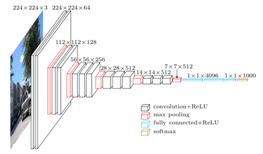

而这个优秀的图像识别网络就是**VGG-19**（由Visual Geometry Group研发的深层卷积网络）

 

## VGG如何运作 ？

正如前面提到的，利用VGG网络前面的不同卷积层能够提取图像的深层特征。如下图所示，我们首先为VGG网络的各层给出代号，以convi_j表示第i个maxpooling层前按顺序的第j个卷积层。

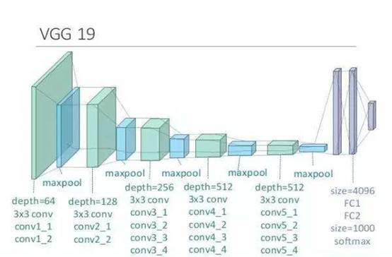

以输入的图像为96x96x3为例，由于卷积层的作用，经过conv1_2卷积层输出的是96x96x64的向量，经过conv2_2层输出的是48x48x128维的向量，经过conv3_4输出的是24x24x256维的向量，经过conv5_4输出的是12x12x512维的向量。假设我们依赖conv5_4进行特征提取，我们发现，**此时对于每一个“像素点”其由3维空间中的一点转化为了512维空间中的一点，与此同时，此时的每一个“像素点”都意味着原图片中的一片感受野**，相比原图片中的一个像素更为抽象，包含了诸如图像结构之类的潜在信息。

如果我们**先将生成图像和目标图像同时导入vgg网络，提取conv5-4层的输出**，依据这个512维空间下的欧式距离（the euclidean distance）定义新的loss函数，即得到更贴近人主观感受的**Perceptual Loss:**

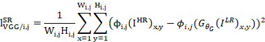

 

## 我们的验证——不同的学习路线

​       对于Perceptual Loss是否能够提取图像的深层信息，进而更好地重建图像，我们进行了相关的对比，下面是我们分别使用普通的pixel-wise MSE与Perceptual Loss作为损失函数进行图像超分辨率实验的过程

| MSE | VGG |
| ---- | ---- |
|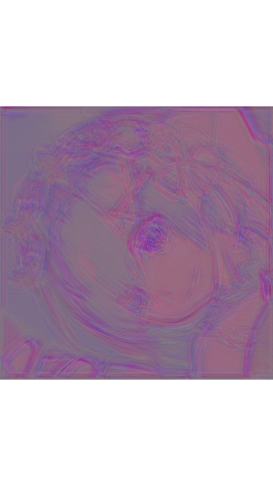|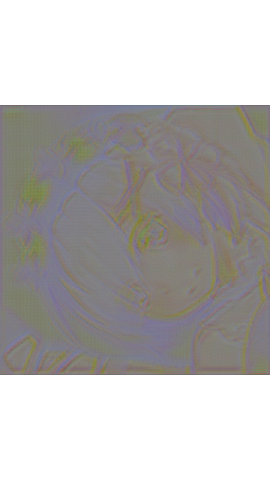|

​       从上述两图的对比中，我们能够清晰地感受到两条不同的学习路线，利用在RGB空间的pixel-wise MSE为损失函数的神经网络迅速地使生成图像的部分颜色趋近于真实图像，但与此同时其对整体结构的细节描摹存在明显不足。而相反地，以Perceptual Loss为损失函数的神经网络对于色彩的变化不如pixel-wise MSE，但其在整体色调和真实图片相差较大的情况下就学习到了如何描摹出较好的图像整体轮廓，且在训练过程中它更注重整体色调的一致变化。

## 题外话：VGG优秀在哪里？

VGG是由牛津大学计算机视觉组（Visual Geometry Group）在2014年研发的深层网络，并一举拿下了ILSVRC2014比赛分类项目的第二名（第一名是GoogLeNet，也是同年提出的）和定位项目的第一名。

VGGNet的特色在于其深度。通常来说网络的复杂度随着深度变深递增，而更为复杂的网络往往能够取得更优秀的结果。

VGGNet采用连续的几个3x3卷积核代替常见的大卷积核（11x11，7x7，5x5），从而**在具有相同感受野的情况下能够节省参数，提升网络的深度**。具体地，VGGNet**采用3个3x3卷积核代替7x7卷积核，采用2个3x3卷积核代替5x5卷积核**。原理如图示：

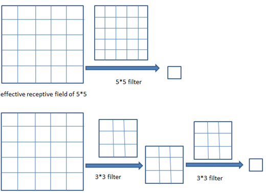

2个3x3卷积核代替5x5卷积核

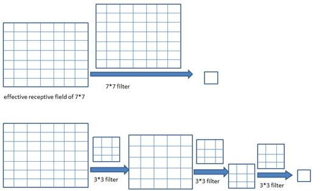

3个3x3卷积核代替7x7卷积核

## 自己创造一个loss函数——GAN

*这是一个古老的故事*

*灵魂画手自小有超能力，他能根据一张低像素的图片画出一张高像素图片，但这一天，他遇到了对手——灵魂鉴别师*

*灵魂画手拿了一幅他的作品，道：“鉴别师，你看这副图片是真是假？”*

*灵魂鉴别师瞧了瞧：“这太假了，你瞧瞧这拙劣的纹路，粗犷的线条…”*

*灵魂画手的自信心备受打击，闭关修炼数天，又有了一幅新的作品。*

*“鉴别师，这幅呢？”*

*“咦？这幅我好像不太好判断…”*

*鉴别师意识到了自己的不足，闭关修炼数天，又提升了自己的鉴别能力*

*若干天后，灵魂画手又递上了一幅画……*

在前面的讨论中，利用预训练的神经网络所得到的Perceptual Loss实现了对深层信息的挖掘已经能够对结果产生比较大的改善。但预训练的模型是一个**固定的模型**，在计算Perceptual Loss时它的**参数不能更新**。这启发了我们，能不能在训练的生成器（Generator）的过程中同时训练出一个能够计算Loss函数的神经网络（参数不断更新）。

想到了这一步，其实我们已经有了GAN（Generative Adversarial Network）的雏形了，GAN在生成器（Generator）的基础上增加了一个鉴别器（Discriminator），用于判断生成器生成的图片的真假。

在我们不断训练生成器的同时，我们将生成器生成的图片和真实图片交给鉴别器鉴别，根据鉴别器的鉴别结果再训练鉴别器，使得鉴别器的鉴别能力也同步提升。同时，生成器的loss函数依赖于鉴别器，二者处于互相博弈的状态。

具体地，对于鉴别器（Discriminator），它的loss函数由交叉熵定义：

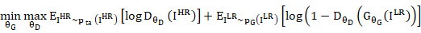

此处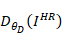指鉴别器将目标图片（真实高像素图片）鉴别为真的可能性，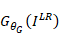指由低像素图片生成的虚假高像素图片，而 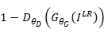可以理解为鉴别器将目标图片鉴别为假的可能性。鉴别器（Discriminator）在尝试最大化此值的同时，生成器Generator在尝试最小化此值，二者形成一种对抗，这便是Generative Adversarial Network名字的由来。

​    

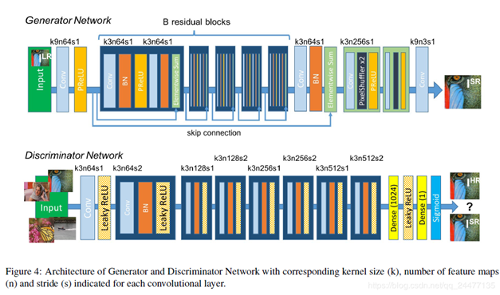

## Some Math Tricks

​       上述定义的交叉熵在实际训练过程中效果并不理想，在实际训练过程中，通常Generator的loss函数由下式替代

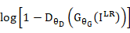

​       即Generator只考虑它自身的交叉熵，而不考虑全局的交叉熵。这样做能够确保任何博弈失利的一方仍有较强的梯度以扭转不利局面。通常称采用这个loss的博弈为Non-saturating heuristic game。

​       但这样的做法又依然存在一些不足，在训练初期，Generator的生成图片质量还不是很高，Discriminator可以较快地学习到二者之间的差异，将生成图片判定为假，即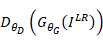趋紧于0，然而观察log(1-x)的图像(左下图)，其在**x=0**处时梯度较小，不利于训练，所以，一个比较好的做法是采用log(x)(右下图)进行替代，从而获得较好的梯度。

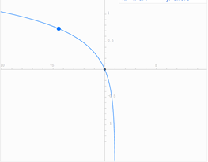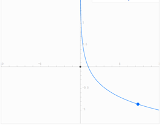

​       此时，对于Generator的loss函数为：

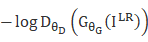

​       我们将其称为对抗损失（Adversarial Loss）

## 题外话：GAN与博弈论

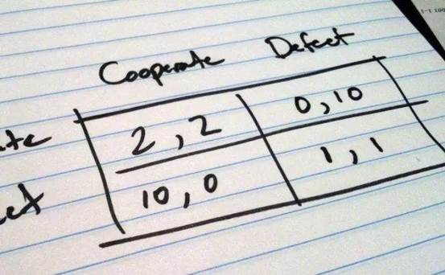

​       GAN的本质是一个博弈模型，生成器（Generator）与鉴别器（Discriminator）在博弈过程中不断地增强自己的技能。

​       从博弈论的角度来看，如果博弈属于**零和博弈**（zero-sum game），二者最终会达到**纳什均衡**，即存在一组策略(g, d)，如果Generator不选择策略g，那么对于Discriminator来说，总存在一种策略使得Generator输得更惨；同样地，将Generator换成Discriminator也成立。囚徒的困境就是一个典型的零和博弈。

如果GANs定义的loss函数满足零和博弈，并且有足够多的样本，双方都有充足的学习能力情况，可以证明，在这种情况下，Generator和Discriminator的最优策略即为纳什均衡点，也即：**Generator**产生的都是“真实高分辨率图像”，**Discriminator**会把任何一张以**1/2**的概率判定为真实。**

(当然我们前面对于loss函数的改进已经使得该loss函数不满足零和博弈)

## SRGAN——Perceptual Loss和Adversarial Loss的结合

​       最终我们采用的是SRGAN同时利用了Perceptual Loss和Adversarial Loss，同时利用二者的优势，二者以一定比例形成最终的Loss函数：

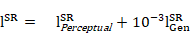

## 现在可以公开的情报

左上角是输入图像，中间是用双三次插值还原出来的放大两倍图，下面是我们的项目放大四倍的图。

### 附加案例1

 

### 附加案例2

 

### 附加案例3
 
  

