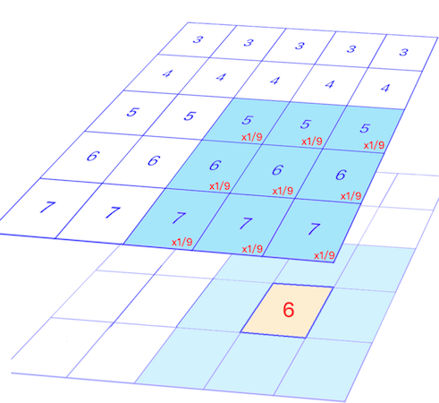
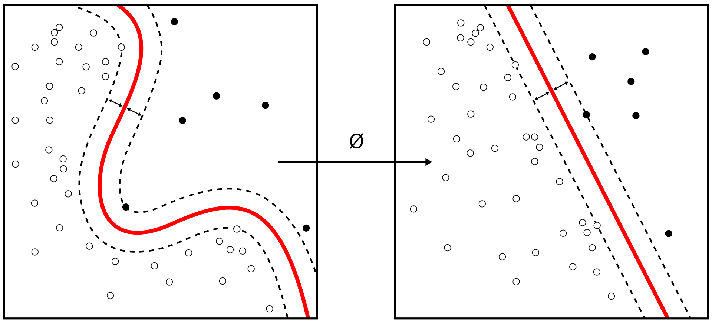

# waifu4x

## 这个项目是做什么的

​		计算机计算速度的不断提升，不仅体现在我们的CPU有了更高的性能，还体现在我们的内存容量更大访问更快，显示器的分辨率也不断提高。因此，我们对于图像分辨率的要求也更加苛刻。

​		而我们的项目的功能，就是将一张（或多张）分辨率较低的图像，通过一定的技术手段，生成一张分辨率高的图像。这就是图像超分辨率重建技术。我们有时候保存了有趣的图片/表情包，想要用的时候发现竟然保存的是低像素的版本，这时候我们的项目就能解决这个问题。

$\displaystyle\large\Longrightarrow$

## 模糊的拟合-插值算法

我们用一个简单的例子来解释插值算法在图像超分辨率重建技术的应用，对于一张分辨率 3 x 2的图像，我们要把它变成 6 x 4的图像。

原图每个像素点的亮度值是：

我们建立一个6 x 4的图像，把这6个已经知道的点，放在他们大概应该在新图的位置：

我们如何知道蓝色部分的亮度值？我们自然的联想到多项式的插值算法，多项式的插值算法帮助我们能够从若干个离散的点还原出原多项式的形式, 然而多项式与图像的区别的在于我们是没有办法用一个特定形式的表达式去表示一个图像的。所以我们只能去尝试不同的表达，寻找合适的插值形式以求达到更好的效果。

​		基于插值的方法将每一张图像都看做是图像平面上的一个点，那么对超分辨率图像的估计可以看做是利用已知的像素信息为平面上未知的像素信息进行拟合的过程，这通常由一个预定义的变换函数或者插值核来完成。基于插值的方法计算简单、易于理解，但是也存在着一些明显的缺陷。

​		首先，它假设像素灰度值的变化是一个连续的、平滑的过程，但实际上这种假设并不完全成立。其次，在重建过程中，仅根据一个事先定义的转换函数来计算超分辨率图像，不考虑图像的降质退化模型，往往会导致复原出的图像出现模糊、锯齿等现象。常见的基于插值的方法包括最近邻插值法、双线性插值法和双立方插值法等。

## 特征提取-卷积

为了更好的作进一步研究，我们首先需要寻求一种数学模型来对图像进行表示，对于一张图像， 我们可以把它转化为一个矩阵。

   $\displaystyle\large\Longrightarrow$    

而对数字图像做卷积操作其实就是利用卷积核（卷积模板）在图像上滑动，将图像点上的像素灰度值与对应的卷积核上的数值相乘，然后将所有相乘后的值相加作为卷积核中间像素对应的图像上像素的灰度值，并最终滑动完所有图像的过程。 

我们经常能看到的，平滑，模糊，去燥，锐化，边缘提取等等工作，其实都可以通过卷积操作来完成。

如果我们想要尝试平滑图像，利用对于$a_{1,1}$点，就在矩阵中去除$a_{1,1}$点附近的点与平滑矩阵进行卷积运算，平滑矩阵可以简单使用算术平均矩阵$g$，
$$
g=
\begin{bmatrix}     
\frac 1 9 & \frac 1 9 & \frac 1 9 \\    
\frac 1 9 & \frac 1 9 & \frac 1 9 \\    
\frac 1 9 & \frac 1 9 & \frac 1 9 \\    
\end{bmatrix}
$$
下图是应用平滑矩阵处理的示例。

如果我们尝试用其他矩阵对图像进行卷积, 例如:
$$
\begin{bmatrix}
-1 & 0 & 1\\
-2 & 0 & 2 \\
-1 & 0 & 1 \\
\end{bmatrix}
$$
我们会得到

可以看到，矩阵在一定程度上提取除了原图边缘的一些特征，可以看到卷积还是十分强大的。利用卷积，我们可以获得原图的一些重要特征。

## 深度学习方法

**深度学习**（英语：deep learning）是机器学习的分支，是一种以人工神经网络为架构，对数据进行表征学习的算法。

深度学习是机器学习中一种基于对数据进行表征学习的算法。观测值（例如一幅图像）可以使用多种方式来表示，如每个像素强度值的向量，或者更抽象地表示成一系列边、特定形状的区域。而使用某些特定的表示方法更容易从实例中学习任务（例如，人脸识别或面部表情识别）。深度学习的好处是用非监督式或半监督式的特征学习和分层特征提取高效算法来替代手工获取特征。

基于深度学习的图像超分辨率技术的重建流程主要包括以下几个步骤：

(1) 特征提取：首先对输入的低分辨率图像进行去噪、上采样等预处理，然后将处理后的图像送入神经网络，拟合图像中的非线性特征，提取代表图像细节的高频信息。

(2) 设计网络结构及损失函数：组合卷积神经网络及多个残差块，搭建网络模型，并根据先验知识设计损失函数；

(3) 训练模型：确定优化器及学习参数，使用反向传播算法更新网络参数，通过最小化损失函数提升模型的学习能力；’

(4) 验证模型：根据训练后的模型在验证集上的表现，对现有网络模型做出评估，并据此对模型做出相应的调整。

下面是一个用于图像超分辨率的网络示例：

## GAN

## 现在公开的情报
### 附加案例1

 

### 附加案例2

 
### 附加案例3

 

